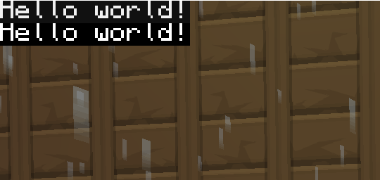

# CCanvas-Writer

Write CC-styled fonts to your terminal glasses!

# Usage:
```
writer(
    text:string,
    xpos:number,
    ypos:number,
    textColor:table[number,number,number],
    backgroundColor:table[number,number,number]
  )
  Where:
    text: the text you want to write
    xpos: the x position of the text (Warning: Not like the terminal,
          an x value of 2 only moves forward by one pixel rather than full
          character from x = 1)
    ypos: the y position of the text (Warning: Not like the terminal,
          a y value of 2 only moves down by one pixel rather than full character
          from y = 1)
    textColor: a table of 3 rgb values [0-255] for the text color
               {255, 0, 0} is red
               {0, 255, 0} is blue
               {0, 0, 255} is green
      OR: a colo[u]rs api color
    textColor: a table of 3 rgb values [0-255] for the background color
               {255, 0, 0} is red
               {0, 255, 0} is blue
               {0, 0, 255} is green
      OR: a colo[u]rs api color
```

# I want my hands on this thing and I want my hands on this thing now!

## Minified (If you only want to use this to write to the screen):

1. Run `wget https://raw.githubusercontent.com/fatboychummy/Canvas-Writer/master/Minified.lua writer.lua` in the shell

## Non minified (If you want to edit the api to do something else):

1. Run `wget https://raw.githubusercontent.com/fatboychummy/Canvas-Writer/master/CanvasWriter.lua writer.lua` in the shell
2. Run `wget https://raw.githubusercontent.com/fatboychummy/Canvas-Writer/master/font.lua font.lua` in the shell


## Both:
In your program, use CCanvas Writer like so:
```
local writer = require("writer")
writer("Hello world!", 0, 0, colors.white, colors.black)
-- or alternatively
writer("Hello world!", 0, 10, {255, 255, 255}, {0, 0, 0})
```

The above program will make the following:

